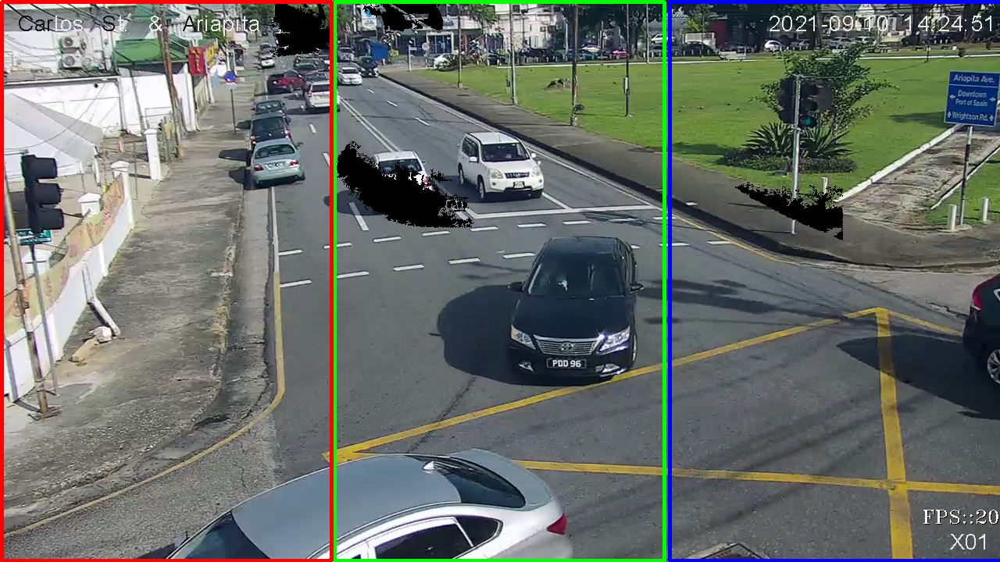
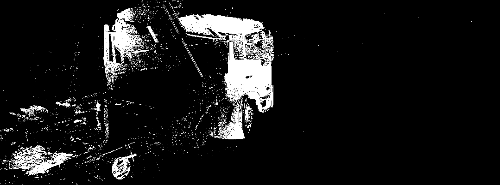

# Motion Dection 
+ I found that using a `createBackgroundSubtractorKNN` over `createBackgroundSubtractorMOG2` with a low history and high threshold I was able to get a better vision.

+ After we add a background subtractor, adding a threshold is able to make some of the stray particals come togeather.

+ When we do out contours check we can determin the center points of the shapes and output which region it fall under. (Left | Midle | Right)

# Preview

