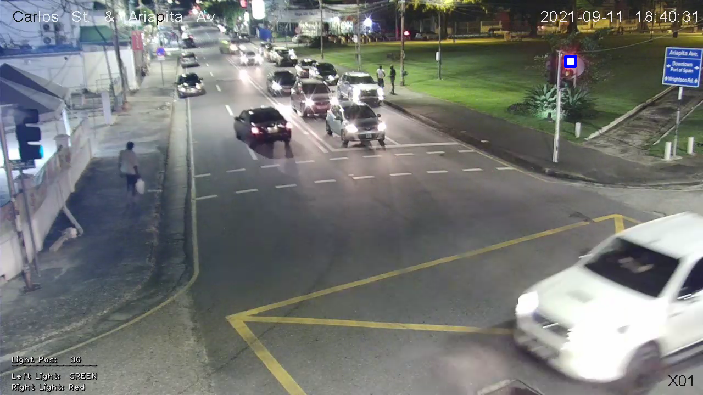

# Traffic Light Detection
### How works
+ Crop the image to get better results 
+ Add a `medianBlur` for better results but not too much. It me it was like trying todo that thing where you bring your eyes together and everything get blury or you look through a dirty glass and all the lights turn into large blobs? Kinda works like that I found.
+ Using `inRange` with a black and off red we can get the colors.
+ After we add a mask and find the contours, doing a calculation for the center points we check if the light is in one of the 3 pre-defined regions

### Results
+ Day Time: 30% detection
    + Day time lost of detection I feel can be done better with more tuning to the color range. Using a brightness dector we can deturnmine that.
+ Night Time: 98% detection

# Future improvements
+ Using Tiny Yolo to detect a traffic light and attach to it even tho that leaves alot of room for error.

# Preview

